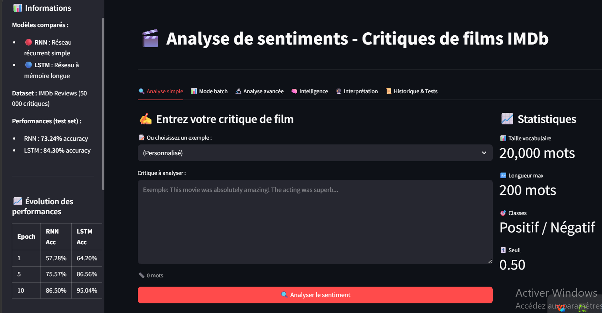
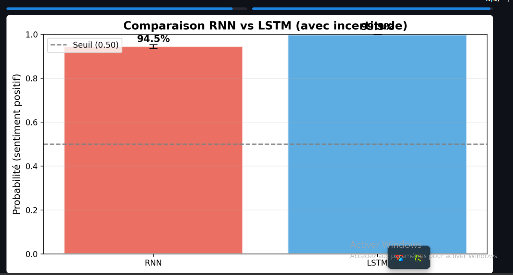
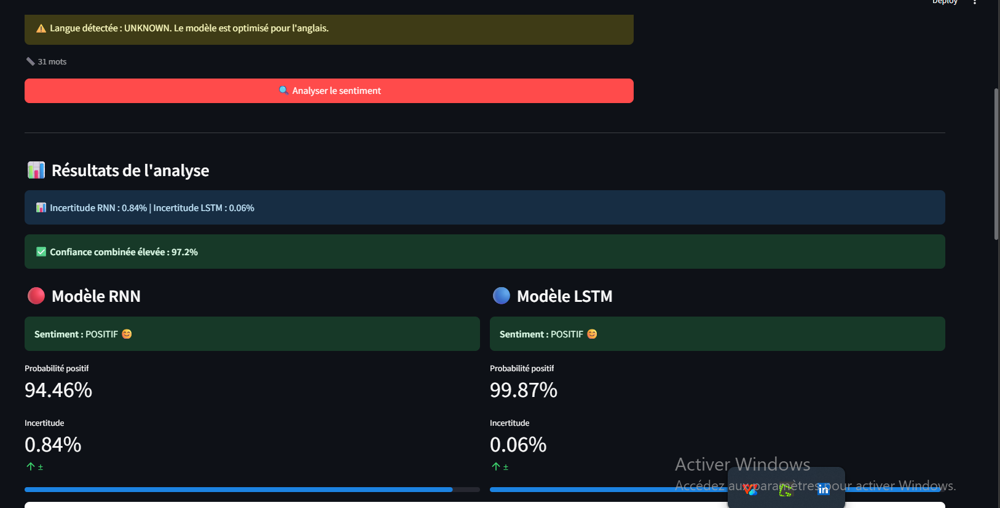
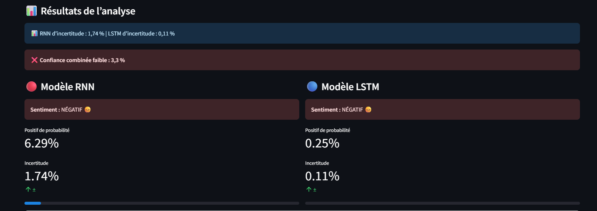
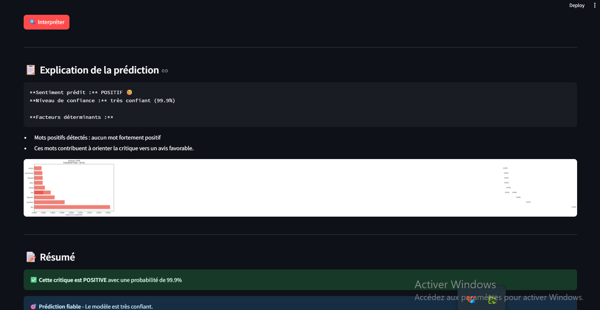
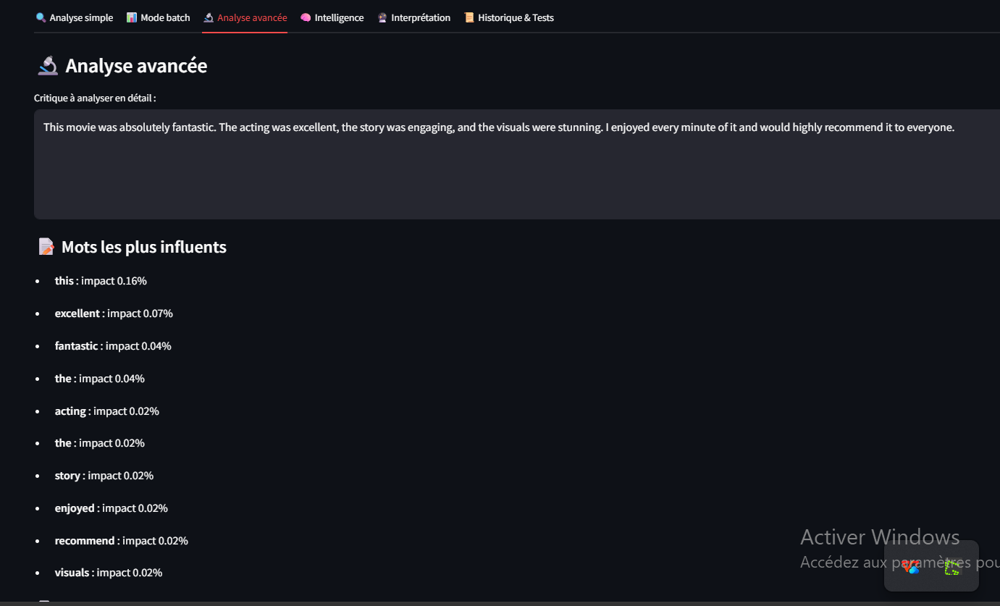
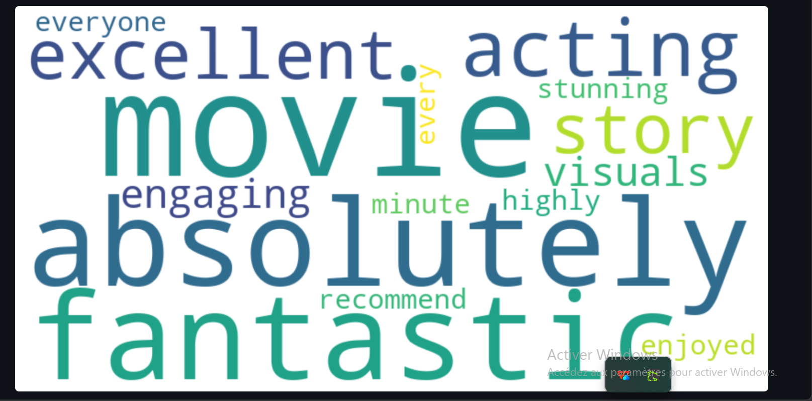
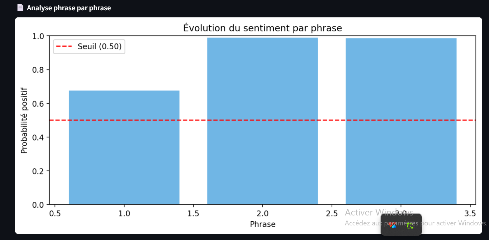

# 🧠 NLP - RNN vs LSTM pour la classification de sentiments

[](https://www.python.org/)
[](https://pytorch.org/)
[](https://huggingface.co/)
[](https://streamlit.io/)
[](LICENSE)

---

## 📌 Description

Ce projet compare deux architectures de réseaux de neurones récurrents sur une tâche de classification de sentiments binaire (positif/négatif) à partir des critiques de films **IMDb**.

| **Élément** | **Détail** |
|-------------|------------|
| **Tâche** | Classification de sentiments (Sentiment Analysis) |
| **Modèles** | RNN bidirectionnel vs LSTM bidirectionnel |
| **Dataset** | IMDb Reviews (HuggingFace) - 50 000 critiques |
| **Vocabulaire** | 20 000 mots |
| **Padding** | 200 tokens |

---

## 🎯 Objectifs

- Construire un pipeline NLP complet (nettoyage → tokenisation → padding)
- Entraîner deux modèles (RNN et LSTM) sur 10 epochs
- Évaluer et comparer leurs performances
- Déployer une application de démonstration interactive avec Streamlit

---

## 📊 Résultats

| **Modèle** | **Accuracy** | **F1-Score** | **Temps inférence** |
|------------|--------------|--------------|---------------------|
| **RNN** | 73.24% | 0.7337 | 73s |
| **LSTM** | **84.30%** | **0.8393** | 161s |

> ✅ **Conclusion** : Le LSTM surpasse le RNN de **+11,06 points d'accuracy**, confirmant sa supériorité pour la gestion des dépendances longues (vanishing gradient).

---

## 📁 Structure du projet

---

## 📸 Dashboard Streamlit

### Page d'accueil


### Comparaison RNN vs LSTM


### Résultat positif


### Résultat négatif


### Explication de la prédiction


### Mots les plus influents


### Nuage de mots


### Analyse par phrases


---

## 🔧 Installation

```bash
# Cloner le dépôt
git clone https://github.com/kabangesylvain-ui/nlp-rnn-lstm-sentiment-analysis.git
cd nlp-rnn-lstm-sentiment-analysis

# Créer un environnement virtuel
python -m venv venv
source venv/bin/activate  # Sur Windows : venv\Scripts\activate

# Installer les dépendances
pip install -r requirements.txt

# Lancer le dashboard Streamlit
streamlit run app.py
